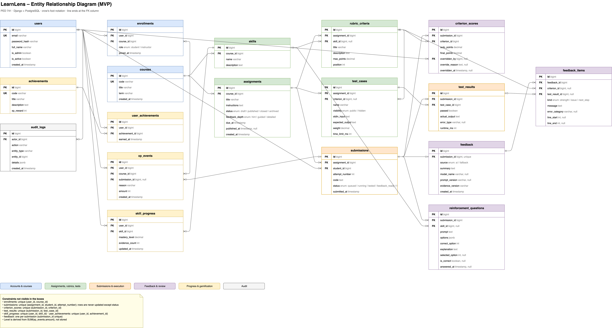

# LearnLens ERD

- `learnlens-erd.drawio` — source of truth. Edit it in draw.io (desktop app or app.diagrams.net).
- `learnlens-erd.png` — rendered export for viewing on GitHub.



After editing the diagram, regenerate the PNG:

```sh
/Applications/draw.io.app/Contents/MacOS/draw.io -x -f png -s 2 \
  -o docs/erd/learnlens-erd.png docs/erd/learnlens-erd.drawio
```

Database models (Django + PostgreSQL) must match this diagram. Update the diagram in the same pull request as any schema change.
